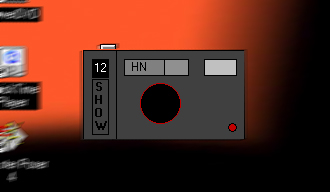



## \_Desktop Cam\_

### Description

A Nice Looking Screen Capturing Tool. Use this camera take pictures of your desktop screen. You

can take screenshots for your works using this

program.

By the way, your vote is appreciated by me.
 
### More Info
 

             |
---                |---
**Submitted On**   |2001-07-22 09:05:18
**By**             |[Hesan Feghhi](https://github.com/Planet-Source-Code/PSCIndex/blob/master/ByAuthor/hesan-feghhi.md)
**Level**          |Intermediate
**User Rating**    |4.0 (84 globes from 21 users)
**Compatibility**  |VB 6\.0
**Category**       |[Complete Applications](https://github.com/Planet-Source-Code/PSCIndex/blob/master/ByCategory/complete-applications__1-27.md)
**World**          |[Visual Basic](https://github.com/Planet-Source-Code/PSCIndex/blob/master/ByWorld/visual-basic.md)
**Archive File**   |[Desktop Ca232397222001\.zip](https://github.com/Planet-Source-Code/hesan-feghhi-desktop-cam__1-25287/archive/master.zip)

